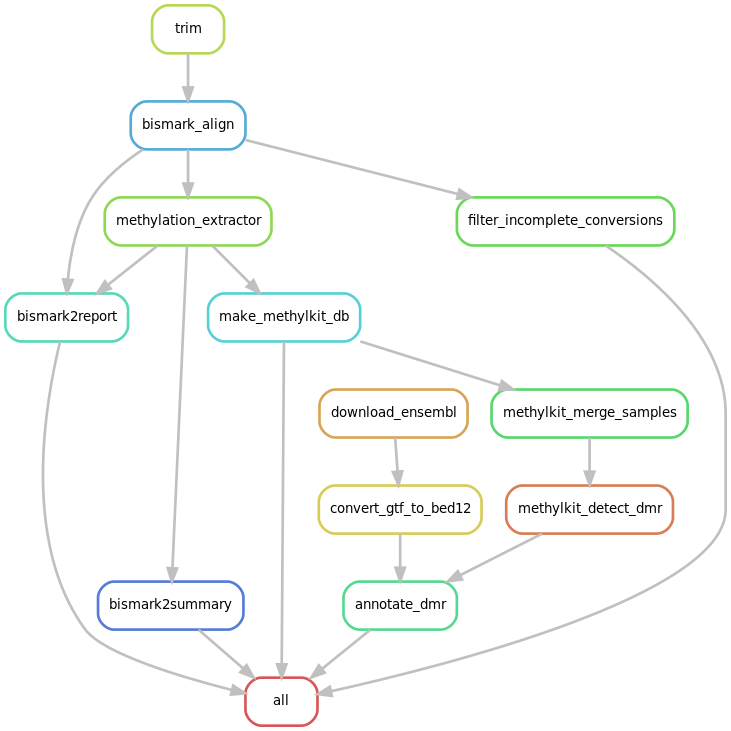

[](https://hackmd.io/cksQRWI5SKOrVTogW4DzMQ)

# MethylSnake

A Snakemake pipeline for RRBS data analysis

## Overview

This pipeline implements a DNA methylation data analysis workflow. Currently, it is taylored toward RRBS data analysis but it can be easity tweaked to support other data types. 

Starting from raw reads in FASTQ format, it runs basic QC reporting, reads trimming, alignment, methylation extraction, filtering of incomplete conversions and differential methylation calls both at single base resolution and fixed-size tiles. Moreover, it runs basic downstream  genomic annotation. 

The final output of the pipeline are a set of files for alignment, detected features, annotation and reports in a variety of formats (bam, bed, pdf, html). R objects are also returned for retrospective inspection and further downstream analysis.



## Quick start
1. Prepare genome indexes for the [Bismark aligner](https://www.bioinformatics.babraham.ac.uk/projects/bismark/Bismark_User_Guide.pdf).
2. [Write a sample sheet](#how-to-write-the-sample-sheet) with per-sample specifications
3. [Generate config file](#how-to-generate-the-config-file) 
4. [Start the pipeline](#how-to-run-the-pipeline)

### Tools

- QC: **FastQC**
- Trimming: **Trim_galore** (Cutadapt wrapper)
- Alignment + methlyation extraction: **Bismark** (using Bowtie2)
- Differential methylation detection: **MethylKit** (Bioconductor package)

## Dependencies

- `snakemake` 5.20.1: `pip install --user snakemake` or via Conda
- `pyaml` 20.4 (PyYAML 5.3.1): `pip install --user pyaml`
- `singularity` 3.6.1 has to be installed system wide, ask your admin
- `slurm` 18.08.8 has to be installed system wide, ask your admin 

## How to write the sample sheet

The sample sheet has to be saved in csv format, quotes are not mandatory but **field separator has to a semicolon and headers are mandatory**. 

The table is composed of two columns:
- `sample_name`: this field should match the input file name(s), e.g. if reads for a sample are stored in `sample1.fq.gz`, the `sample_name` column value should be `sample1`. In case of paired end reads, `sample1_R1.fq.gz` and `sample1_R2.fq.gz` the value of this column should be `sample1`.
- `treatment`: a numerical value representing the treatment. The value 0 (zero) always represent control samples. 

An example with two treatments, control and triplicate replicates per treatment:
```
sample_name;treatment
sample1;0
sample2;0
sample3;0
sample4;1
sample5;1
sample6;1
sample7;2
sample8;2
sample9;2
```
In this setup, samples 1, 2 and 3 are control; samples 4, 5, 6 correspond to treatment 1 and samples 7, 8, 9 to treatment 2.

## How to generate the config file 

The Snakemake config file holds all tunable parameters of the pipeline. Check [this section](#complete-list-of-config-parameters) for a complete list and relative explanation. For simplicity, all paths should be absolute. 

A wrapper script with an example invocation can be found in `run_make_config.sh`, It can be tweaked and run to generate a valid config file. 

## How to run the pipeline

The pipeline runs inside a Singularity container. This container should contain all the necessary tools to run the analysis. See [below](singularity-container) for additional details. 

The pipeline can be started with the wrapper script `run_snakemake.sh`. 

The scripts parses the config YAML file searching for four folder to bind mount in the Singularity container: working directory, the genome directory, the genome index directory, the directory holding annotations and the temporary directory. All these paths can be specified when running the config script.

#### Slurm configuration

A Slurm configuration is given in `cluster-config/cluster.json`. In the json files, keys correspont to Snakemake rule names. Values are in turn objects with keys corresponding to Slurm parameters and values corresponding to desired values for the parameter:

```json
...
"trim":
    {
        "time"      : "6:00:00",
        "mem"       : "8G"
    },
...
```

The example above assigns maximum runtime of six hours and 8GB or memory to the `trim` rule. The "\_\_default\_\_" key provides default parameters applied to all rules:

```json
...
"__default__":
    {
        "jobname"   : "{rule}",
        "log"       : "slurm-%x-%j.log",
        "ntasks"    : 1,
        "cpus"      : 1,
        "mem"       : "4G",
        "time"      : "00-00:20:00",
        "partition" : "normal,parallel"
    }
...
```

By default, each job is spawned with the rule name and logs to a file named after the rule and the jobid generated by Slurm. Each job is assigned 1 task, 1 CPU and 4GB of RAM. Maximum runtime is 20 minutes. Allowed partitions are normal and parallel. 

#### Singularity container

The pipeline is designed to run within a Singularity container. The path to the container can be configured with the config script. 

A working container can be pulled from SingularityHub:

```
singularity pull --name methylkit.sif shub://ftabaro/MethylSnake:methylkit
```

Checkout the [`singularity`](https://github.com/ftabaro/MethylSnake/tree/master/singularity) folder for more info.

The container path has be specified in the command line arguments of the config script.


## Output description

This pipeline generates a number of output files:

- [FastQC reports](https://www.bioinformatics.babraham.ac.uk/projects/fastqc/good_sequence_short_fastqc.html) for input and trimmed reads
- Fastq files for trimmed reads files with reports (Fastqc and text)
- Alignment files with report and nucleotide statistics
- Alignment files with incomplete conversions removed
- Methylation files in GpG, CHG and CHH contexts
- [Bismark HTML reports](http://www.bioinformatics.babraham.ac.uk/projects/bismark/PE_report.html)
- [Bismark HTML summary](https://www.bioinformatics.babraham.ac.uk/projects/bismark/bismark_summary_report.html)
- rds files with every object computed by [MethylKit](https://bioconductor.org/packages/release/bioc/vignettes/methylKit/inst/doc/methylKit.html)
- bed files of differential methylation calls
- Figures
  - prelimimary coverage and methylation state histograms
  - samples PCA and correlations
  - number of differentially methylated features per chromosome (DMC and DMR)
  - pie charts of annotation classes
    - all differentially methylated features
    - hyper methylated
    - hypo methylated
- Tables
  - distance to TSS for all, hyper and hypo methylated features (csv)

### Ouput folder hierarchy

An example of output directory (all directory names can be changed from the config file)

```
.
├── alignments
├── bed
│   ├── dmc
│   └── dmr
├── fastqc
├── log
├── pictures
│   ├── dmc
│   └── dmr
├── reads
│   └── fastqc
├── RData
│   ├── dmc
│   └── dmr
├── reports
├── tables
│   ├── dmc
│   └── dmr
└── trimmed

```

## Useful links

- https://www.nature.com/articles/nmeth.1828
- https://www.epigenesys.eu/images/stories/protocols/pdf/20120720103700_p57.pdf
- https://www.bioinformatics.babraham.ac.uk/projects/fastqc/
- https://www.bioinformatics.babraham.ac.uk/projects/trim_galore/
- https://github.com/FelixKrueger/TrimGalore/blob/master/Docs/Trim_Galore_User_Guide.md
- https://www.bioinformatics.babraham.ac.uk/projects/bismark/
- https://www.bioinformatics.babraham.ac.uk/projects/bismark/Bismark_User_Guide.pdf
- https://github.com/FelixKrueger/Bismark/tree/master/Docs

## Contributing
Bug reports and pull requests are welcome on GitHub at https://github.com/ftabaro/rrbs-pipeline/issues

## Complete list of config parameters
```
  --config-path CONFIG_PATH
                        Path for the config file
                        
  --wd WD               Working directory. Root directory of the project
  
  --genome-path GENOME_PATH
                        Path to a fasta file with genome sequence
                        
  --bismark-index-path BISMARK_INDEX_PATH
                        Path to Bismark index files (only index name required:
                        /path/to/index/folder/hg38*)
                        
  --sample-sheet SAMPLE_SHEET
                        Path to csv file holding samples information
                        
  --annotation-file ANNOTATION_FILE
                        Path to a gzipped GTF file.
                        
  --dmr-window-size DMR_WINDOW_SIZE
                        Window size for tiled differential methylation
                        analysis
                        
  --dmr-step-size DMR_STEP_SIZE
                        Step size for tiled differential methylation analysis
                        
  --dmr-difference DMR_DIFFERENCE [DMR_DIFFERENCE ...]
                        Difference in reads coverage threshold for
                        differential methylation analysis
                        
  --dmr-qvalue DMR_QVALUE [DMR_QVALUE ...]
                        Q-value threshold for differential methylation
                        analysis
                        
  --min-per-group MIN_PER_GROUP
                        An integer denoting minimum number of samples per
                        replicate needed to cover a region/base
                        
  --mate1-pattern MATE1_PATTERN
                        Pattern to identify mate 1 in paired sequencing files e.g. R1 or _R1 or _1
                        
  --mate2-pattern MATE2_PATTERN
                        Pattern to identify mate 2 in paired sequencing files e.g. R2 or _R2 or _2
                        
  --fastq-extension FASTQ_EXTENSION
                        File extension of reads fastq files e.g. fastq.gz or fq.gz or fastq
                        
  --genome-version GENOME_VERSION
                        Label for genome version used in the analysis e.g. hg38 or hg19
                        
  --singularity-container SINGULARITY_CONTAINER
                        Path to a singularity container with all necessary
                        tools installed.
                        
  --tmp-folder TMP_FOLDER
                        Path to a temporary folder (possibly fast storage) e.g. /scratch
                        
  --log-folder LOG_FOLDER
                        Path to a log folder
                        
  --reads-folder READS_FOLDER
                        Path to a folder with reads to be processed
                        
  --trimmed-folder TRIMMED_FOLDER
                        Path to folder to write trimmed reads in
                        
  --alignments-folder ALIGNMENTS_FOLDER
                        Path to a folder to write alignments in
                        
  --reports-folder REPORTS_FOLDER
                        Path to a folder to write Bismark reports in
                        
  --nucleotide-stats-folder NUCLEOTIDE_STATS_FOLDER
                        Path to write Bismark nucleotide report files in
                        
  --methylkitdb-folder METHYLKITDB_FOLDER
                        Path to write methylKit tabix files in
                        
  --rdata-folder RDATA_FOLDER
                        Path to write RDS objects used in methylKit analysis
                        
  --bed-folder BED_FOLDER
                        Path to write BED files for DMR/DMC coordinates to
                        
  --pictures-folder PICTURES_FOLDER
                        Path to a folder to write plots in
                        
  --tables-folder TABLES_FOLDER
                        Path to a folder to write tables in
                        
  --fastqc-folder FASTQC_FOLDER
                        FastQC results folder
                        
  --low-coverage-count LOW_COVERAGE_COUNT
                        Number of reads for low coverage filtering
                        
  --high-coverage-percentage HIGH_COVERAGE_PERCENTAGE
                        Percentage of the coverage distribution for high
                        coverage filtering (PCR duplicates)
```

###### tags: `snakemake` `DNA-methylation` `rrbs`
